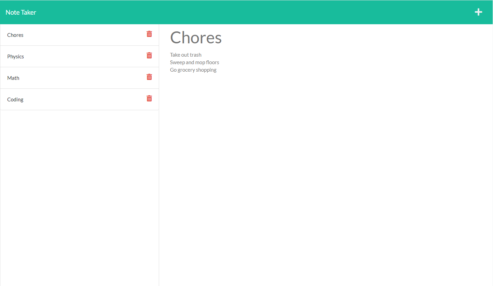

# Express.js Note Taking App

# Description
Simple application that uses Express.js and is hosted on Heroku to take and delete notes.

# Technologies Used 
- Express.js
- Node.js
- uuid npm package

# Usage

[Express.js Note Taking App](https://afternoon-refuge-30426.herokuapp.com/) is hosted on Heroku!

# License

> This project is using the MIT license.
